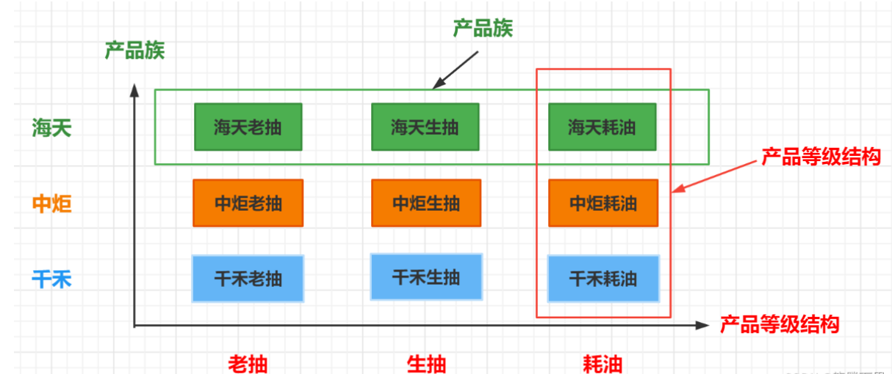

# 设计模式复习之路

## 目录
  
  * [创建型模式](#创建型设计模式)
    * [单例模式](#单例模式)
    * [方法工厂模式](#工厂模式)
    * [抽象工厂模式](#抽象工厂模式)
    * [建造者模式](#建造者模式)
    * [原型模式](#原型模式)
  * [结构型模式](#结构型模式)
    * [适配器模式](#适配器模式)
  * [行为型模式](#行为型模式)
  * [总结](#总结)

## 创建型设计模式

### 单例模式

总结：

- 饿汉式：饿汉式的实现方式，在类加载的期间，就已经将 instance 静态实例初始化好了，所以 instance 实例的创建是线程安全的。不过，这样的实现方式不支持延迟加载实例。
- 懒汉式：相对于饿汉式的优势是支持延迟加载。这种实现方式会导致频繁加锁、释放锁，以及并发度低等问题，频繁的调用会产生性能瓶颈。
- 双重检测：双重检测实现方式既支持延迟加载、又支持高并发的单例实现方式。只要 instance 被创建之后，再调用 getInstance() 函数都不会进入到加锁逻辑中。所以，这种实现方式解决了懒汉式并发度低的问题。
- 静态内部类：利用 Java 的静态内部类来实现单例。这种实现方式，既支持延迟加载，也支持高并发，实现起来也比双重检测简单。
- 枚举方式：最简单的实现方式，基于枚举类型的单例实现。这种实现方式通过 Java 枚举类型本身的特性，保证了实例创建的线程安全性和实例的唯一性(同时阻止了反射和序列化对单例的破坏)。

### 工厂模式

定义：工厂方法使一个产品类的实例延迟到其工厂的子类（定义一个接口，让子类决定实例化哪个接口的实现类）。

目的：封装对象的创建过程，提升创建对象的可复用性。

主要角色

- 抽象工厂：提供创建产品的接口，调用者通过访问接口访问具体工厂的工厂方法来创建产品。
- 具体工厂：实现抽象工厂的抽象方法，完成具体产品的创建。
- 抽象产品：定义了产品的规范，描述了产品的主要特性和功能。
- 具体产品 ：实现了抽象产品所定义的接口，由具体工厂创建，它与具体工厂之间一一对应。

特点：**一个具体工厂只生产一个具体产品**

总结：**工厂方法模优缺点**
- 优点：
  1. 用户只需要知道具体工厂的名称就可得到所要的产品，无须知道产品的具体创建过程；
  2. 在系统增加新的产品时只需要添加具体产品类和对应的具体工厂类，无须对原工厂进行任何修改，满足开闭原则；
- 缺点：
  1.每增加一个产品就**要增加一个具体产品类和一个对应的具体工厂类**，这增加了系统的复杂度。

应用场景:
- 需要使用很多重复代码创建对象时，比如，DAO 层的数据对象、API 层的 VO 对象等。
- 创建对象要访问外部信息或资源时，比如，读取数据库字段，获取访问授权 token 信息，配置文件等。
- 创建需要统一管理生命周期的对象时，比如，会话信息、用户网页浏览轨迹对象等。
- 创建池化对象时，比如，连接池对象、线程池对象、日志对象等。这些对象的特性是：有限、可重用，使用工厂方法模式可以有效节约资源。
- 希望隐藏对象的真实类型时，比如，不希望使用者知道对象的真实构造函数参数等。

### 抽象工厂模式
定义：提供一个生产一系列相关或相互依赖对象的接口，而无须指定它们具体的类。

> 抽象工厂模式比工厂方法模式的抽象程度更高。在工厂方法模式中每一个具体工厂只需要生产一种具体产品，但是在抽象工厂模式中一个具体工厂可以生产一组相关的具体产品，这样一组产品被称为产品族。产品族中的每一个产品都分属于某一个产品继承等级结构。

特点：抽象工厂模式中一个具体工厂能生产一组相关的具体产品（抽象工厂中的具体工厂负责生产一个产品族）
- 一组相关的具体产品（如海尔旗下的众多调味品）。
- 产品等级结构：每一个产品族都分属于某一个产品继承等级结构（如耗油下的多种品牌）。

主要角色：
- 抽象工厂：提供创建产品的接口，调用者通过访问接口访问具体工厂的工厂方法来创建产品 。
- 具体工厂：实现抽象工厂的抽象方法，完成具体产品的创建。
- 抽象产品：定义了产品的规范，描述了产品的主要特性和功能。
- 具体产品 ：实现了抽象产品所定义的接口，由具体工厂创建，它与具体工厂之间是一对多关系 （一个具体工厂生产多件产品）。

总结：

优点：

- 对于不同产品系列有比较多共性特征时，可以使用抽象工厂模式，有助于提升组件的复用性。
- 当需要提升代码的扩展性并降低维护成本时，把对象的创建和使用过程分开，能有效地将代码统一到一个级别上。
- 解决跨平台带来的兼容性问题。

缺点：

- 增加新的产品等级结构麻烦,需要对原有结构进行较大的修改,甚至需要修改抽象层代码,这显然会带来较大不变,违背了开闭原则。

应用场景：抽象工厂模式向使用（客户）方隐藏了下列变化：

1. 程序所支持的实例集合（具体工厂）的数目；
2. 当前是使用的实例集合中的哪一个实例；
3. 在任意给定时刻被实例化的具体类型；

**要牢记“如何找到某一个类产品的正确共性功能”这个重点。**

### 建造者模式

定义：封装一个复杂对象构造过程，并允许按步骤构造。

就是将复杂对象的创建过程拆分成多个简单对象的创建过程，并将这些简单对象组合起来构建出复杂对象。

> 比如：一辆汽车是由多个部件组成的，包括了车轮、方向盘、发动机等等。对于大多数用户而言，并不需要知道这些部件的装配细节，并且几乎不会使用单独某个部件，而是使用一辆完整的汽车。而建造者模式就是负责将这些部件进行组装让后将完整的汽车返回给用户。

特点：创建一种类型的复杂对象，通过设置不同参数，定制化地创建不同对象。

角色组成：

1. 产品类（Product）：表示被创建的复杂对象。它通常包含多个部分或者组成，并由具体的建造者逐步构建而成。
2. 抽象建造者类（Builder）：定义了建造复杂对象所需要的各个部分的创建方法。它通常包括多个构建方法和一个返回产品的方法。
3. 具体建造者类（ConcreteBuilder）：实现Builder接口，并提供各个部分或者组成的构建方法。
4. 指挥者类（Director）：负责控制建造者的构建顺序，指挥建造者如何构建复杂对象。

简单来说就是  通过指挥者类，调用具体构建者、来实现对不同类型的产品类的创建

优缺点：

优点：
1. 灵活：可以分步骤地构建复杂对象，使得构建过程更加灵活。 
2. 解耦：可以隔离复杂对象的创建和使用，客户端不必关心对象的创建细节。 
3. 易扩展：增加新的具体建造者很方便，可以扩展构建器功能，符合开闭原则。

缺点：
1. 增加工作量：需要额外的代码来创建和管理具体建造者类，增加了程序员的工作量。 
2. 效率低：相比于其他创建型模式，在运行时效率较低，特别是对象太复杂时。

应用场景：

生活场景：

- 盒饭套餐：顾客可以选择不同的菜，服务员按照顾客的要求，将这些菜组合起来，最终构建出一个完整的套餐。
- 盖房子：需要分多个阶段进行，比如准备材料、打地基、盖围墙...。建造者模式可以将房屋的建造分解成多个步骤，每个步骤对应一个具体的建造者，最终由包工头（指导者）来调用不同的建造者，完成整个房子的建造。

Java场景：

- StringBuilder：能够动态地构建字符串。
- Stream API：将集合类转为stream流，通过一系列的中间操作和终止操作来生成最终结果。
- Lombok的@Builder注解：一个注解就可以生成建造者模式的代码。

使用场景：

- 当需要创建一些特定的对象，但是它们拥有共同的组成部分时，比如：一个房子可以由个个部件：框架、墙、窗户等，这些部件可以组合起来构造完整的房子。
- 当对象的构建过程比较复杂且需要多个步骤时，例如，创建一份电子商务订单需要多个步骤，如选择商品、填写地址和支付等，这些步骤可以被分别封装成为订单构建器中的不同方法。
- 当需要创建一些特定类型的对象，例如复杂的数据结构或配置对象时，这在编写配置文件解析器以及通用数据结构如二叉树等时很有用。
- 建造者模式也可以被用于通过更高级的方式来构建复杂对象，例如：序列化和反序列化。

与抽象工厂模式的区别：
- 抽象工厂模式强调的是产品族的创建，即相关的产品一起被创建出来，而建造者模式强调

### 原型模式

原型模式属于创建型设计模式。通过复制现有的实例来创建新的实例，无需知道相应类的信息。

简单的讲就是当我需要创建一个指定的对象时，刚好现在就有这个对象，但又不能直接使用，所以简单的方式就是克隆一个一摸一样的对象来使用。

角色组成：

1. 抽象原型类（Prototype）：定义了一个抽象的克隆方法。
2. 具体原型类（ConcretePrototyoe）：实现抽象原型类（接口）定义的克隆方法，提供一个具体的克隆方法来复制自己。
3. 客户端（Client）：使用原型类的对象来实现具体的操作，即通过复制原型对象来创建新的对象。

优点：

1. 提高了对象创建的效率，在创建大量对象时可以节省时间和资源；
2. 可以隐藏对象创建和初始化的复杂性，并且更容易管理和维护；
3. 可以在运行时动态添加和删除对象；
4. 可以保护原始对象，防止意外修改对原对象产生影响。

缺点：

1. 必须保证原始对象和克隆对象之间的区别，否则可能会产生副作用；
2. 有些对象可能无法进行有效地复制，例如涉及到与其他外部对象交互的对象；
3. 原型模式需要给对象添加一个克隆方法。但是，该方法可能不适用于所有对象类型，例如具有命令行参数的程序。

java场景:

- Object类：Java中的所有类都直接或间接继承自Object类，它提供了一个clone()方法，允许对象在克隆时使用它们的原型对象。
- Collection框架：Iterator接口使用原型模式来提供多个访问数据的独立副本（例如ListIterator和Enumeration）。这种方式可以确保迭代器始终指向正确的位置。
- Apache Commons BeanUtils：Apache Commons BeanUtils库采用了原型模式的方法，通过使用BeanUtils.cloneBean()方法来创建新对象并通过复制其属性来克隆一个Bean。
- Spring框架：在Spring框架中，原型范围bean使用原型模式。例如，在Spring中，可以将作用域设置为prototype，来创建一个bean的多个独立实例，这样每次在容器中注入bean时，将创建新的实例。

适用于开发的场景：

1. 如果一个对象的创建过程包括繁琐的准备工作或重量级的资源初始化，那么每次需要创建新对象时，都需要必须执行这些初始操作，这时就可以使用原型模式，通过复制旧对象来创建新对象，从而避免创建成本高的问题。
2. 如果对象需要修改的属性较多，使用原型模式则可以在原始对象的基础上进行修改，减少代码量。
3. 如果存在多个对象需要共享同一个数据源，可以使用原型模式基于已有的原始对象来进行克隆，避免了重复创建多个对象。
4. 当对象的创建过程涉及多个线程时，需要注意线程安全性。原型模式可以用于在不同的线程之间共享原型对象，并在每个线程中创建对象的副本，确保线程安全性。

## 结构型模式

定义：主要关注对象组合的方式，解决对象之间的关系，解决子系统之间的耦合度和扩展问题。

### 适配器模式

定义：适配器模式是一种结构型设计模式，它允许将不兼容的对象转换成可兼容的接口。主要目的是解决在不改变现有代码的情况下，使不兼容的接口之间能够正常工作，通过创建一个中间转换的适配器来将一个对象转换成我们所需要的接口。

角色组成：

- 目标接口（target）：需要适配的标准接口
- 源对象（source）：需要被适配的不兼容对象
- 适配器对象（adapter）：充当中间转换角色，该对象将源对象转换成目标接口

优点：

- 安全可靠：封装了旧接口，对客户端透明，客户端代码无需修改。
- 提高复用性：可以复用不兼容的类；可以对不同的类无需修改，就可以进行组合。
- 扩展性好：在应用程序开发过程中，可以增加新的适配器和被适配对象。

缺点：

- 过多的适配器会导致系统结构复杂。
- 如果适配器没有实现好，可能会拖慢整个系统的性能。
- 滥用适配器模式会导致系统设计紊乱。

java应用场景

- JDBC驱动程序：不同的数据库提供商实现了不同的JDBC驱动接口，使用适配器模式可以将这些不同的接口适配为标准的JDBC接口，提高应用程序的可移植性。
- 日志框架：Java中有多个常用的日志框架，如Log4j、SLF4J等，不同的日志框架提供的API不同，使用适配器模式可以将这些不同的API适配为一个统一的接口，方便再程序中进行日志记录和管理。
- 第三方库或SDK：在使用第三方库或 SDK 时，可能由于它们实现的 API 不同而导致应用程序复杂，使用适配器模式可以将不同的 API 适配为统一的接口，简化应用程序的调用。

类适配器：使用继承的方式，将需要适配的类转换为目标接口的子类，实现目标接口的所有方法，同时继承适配类的实现，用以完成一些适配逻辑。

对象适配器：通过组合的方式，将适配对象与目标接口组合，实现目标接口的所有方法，并在适配类中调用需要适配对象的方法。

接口适配器：主要适用于需要被适配的接口中，只有用到个别接口，也就是说不需要实现它的全部接口。通过一个中间抽象类或接口实现。

适配器模式的适用场景：

1. 重用现有的代码：适配器模式可以允许我们重用已有的类或接口，而不需要修改其原有的代码。
2. 集成老系统：当现有的系统不满足用户需求时，需要增加系统功能或接口。但是，老系统的接口可能与现有的技术、平台不兼容，此时可以采用适配器模式，将现有的接口适配为新的接口，从而实现新系统的集成。
3. 集成第三方组件：在使用第三方组件时，可能由于它们实现的 API 不同而导致应用程序复杂，此时可以使用适配器模式，将第三方组件提供的 API 适配为自己需要的 API，方便在应用程序中进行调用。
4. 实现跨平台兼容：在不同平台、不同技术栈之间进行开发时，常常需要适配不同的接口，以使得不同的平台或技术栈之间能够相互兼容，此时可以使用适配器模式来处理各种不兼容问题。

### 装饰器模式

定义：装饰者模式是一种结构型设计模式，它允许你**动态地向对象添加新的行为而不影响其原有的行为**。它在运行时给对象动态地添加一些额外的职责，通常是在原有的行为基础上，通过装饰器进行一些修饰，实现了更加灵活的代码复用和扩充。

角色：

抽象构件（Component）：要求装饰者对象都实现一个抽象接口或抽象类。（接口或抽象类）
具体构件（ConcreteComponent）：定义了一个具体的对象，也就是需要被装饰的对象。
抽象装饰器（Decorator）：持有一个真实的构建对象的引用，并且可以动态给该对象添加新的功能。（接口或抽象类）
具体装饰器（ConcreteDecorator）：实现具体的装饰器，向真实的构建对象添加新功能。

优点：

- 非常灵活且可扩展，能动态地为对象添加新的职责和行为。
- 遵循开闭原则，能够实现代码的可维护性和可扩展性。
- 通过使用装饰器对象，可以避免不必要的继承以及子类的数量爆炸性增长问题。

缺点：

- 会导致系统变得复杂，增加了许多类和对象的相互关系，需要开发人员具备更高的抽象能力和设计能力。
- 增加了代码复杂度，使得项目开发和维护更加困难。

Java中的应用场景

1. IO流的处理：这是一个典型的装饰者模式的应用。InputSteam和OutputStream是最基本的抽象组件（Component），而各种FilterInputSteam和FilterOutputStream就是具体的装饰器，它们可以实现各种不同的IO流处理功能，如缓冲、压缩、加密等等。
2. 数据库连接池：连接池为抽象组件(Component)，各种不同的连接池实现(如C3P0、DBCP等)则是具体的装饰器(Concrete Decorator)，它们可以实现不同的连接池缓存策略、连接池大小、超时时间等属性。
3. Spring的AOP：在AOP中，切面就是具体的装饰器(Concrete Decorator)，而业务逻辑则是抽象组件(Component)，通过动态代理技术，将具体的业务逻辑和切面对象组合起来，我们就可以实现在不修改源码的情况下，动态地为业务逻辑添加新的功能。

以英雄联盟中李青（盲僧）学技能为例。其中Hero代表英雄（抽象构件）、BlindMonk（盲僧-具体构件）、SkillDecorator（技能-抽象装饰器）、QWERDecorator为英雄的四个技能（具体装饰器）

总结：

- 给对象添加一些职责，但是又不想改变其原有的接口和实现。
- 需要对不同组合的对象进行扩展，从而避免出现由于继承关系带来的类很多问题。
- 在不使用继承的情况下动态地为一个对象添加一些额外的功能。
- 需要在程序运行时动态地为对象添加不同的功能，或者为对象添加同时使用多个的功能。

一句话，当遇到需要**给某个类添加新功能，但又不能改源代码或不希望影响其他对象的情况下**，可以考虑装饰者模式。

### 代理模式

定义：代理模式属于结构型设计模式。为其他对象提供一种代理以控制对这个对象的访问。

在某些情况下，一个对象**不适合或者不能直接引用**另一个对象，而代理对象可以在客户端和目标对象之间起到中介的作用。

分类： 代理模式分为三类：1. 静态代理 2. 动态代理 3. CGLIB代理

优点：

- 代理模式可以隐藏真是对象的实现细节，使客户端无需知晓真实对象的工作方式和结构。
- 通过代理类来间接访问真实类，可以在不修改真实类的情况下，对其进行扩展、优化或添加安全措施。
- 代理模式实现起来简单，易于扩展和维护，符合面向对象设计原则中的开闭原则。

缺点：

- 代理模式可能会引入额外的复杂性和间接性，增加程序设计和维护的难度。
- 对象代理可能会降低系统性能，特别是在处理大数据量或频繁调用的情况下，因为代理需要额外的计算和网络通信开销。

Java应用场景

- AOP：通过定义切面、切入点和通知等，Spring AOP在运行时生成代理对象，将切面逻辑织入到目标对象的方法调用中。代理对象在方法调用前后执行附加操作，如日志记录、性能监控等。
- 动态代理（JDK动态代理、CGLIB代理）：当Bean类实现了接口时，Spring使用JDK动态代理来为Bean生成代理对象；当Bean类没有实现接口时，Spring使用CGLIB代理来生成代理对象。

#### 静态代理

静态代理是一种在**代码编写期进行代理类**和被代理类的关联的代理方式。

具体实现是创建一个代理类，通常需要实现与被代理类相同的接口或继承被代理类。

注意：静态代理实现它的**真实对象只能有一个**，多个的话，代理对象不能确定哪个对象需要被代理，会导致报错，JDK动态代理没这个问题

缺点：原有接口增加方法，实现类也需要实现新的方法

#### JDK动态代理

JDK动态代理是一种比较常见的代理方式，它是在程序运行时动态生成代理类，也就是说我们在编写代码时并不知道具体代理的是什么类，而是在程序运行时动态生成。

#### Cglib代理

CGLIB代理是在运行时动态生成代理类的方式，它使用的库是cglib，和JDK代理相比，它不是动态的生成一个实现了接口的代理类，而是直接在内存中构建一个被代理类的子类，并重写父类的方法来进行代理。

被代理的类没有实现接口或者无法实现接口

代理类的代理方法需要进行额外的逻辑，如事务处理等。

总结
- 对于没有实现接口的类，只能使用CGLIB代理
- 对于实现了接口的类，可以使用JDK代理或者CGLIB代理，如果要求比较高的话，建议使用JDK代理。
- 对于单个代理类的情况，并且被代理类实现了接口，可以使用静态代理。
- 对于多个被代理类的情况，建议使用JDK代理或CGLIB代理。

### 外观模式

定义：这个大家一定是经常使用的，外观模式（门面模式）是一种结构型设计模式。它提供一个统一的接口，用于访问子系统中的一组接口，隐藏了系统的复杂性。最简单的应用就是，当controller层的逻辑处理比较复杂，就可以考虑把这些逻辑封装成一个外观类。

角色：
- 外观：提供了访问子系统一组接口的统一接口，并将客户端请求委派给相应的子系统对象处理。
- 子系统：实现了子系统的具体功能，处理来自外观对象的请求。

优点：
- 简化接口：隐藏了一系列复杂的子系统接口，使得客户端更加方便的使用。
- 解耦：外观模式讲客户端和子系统之间进行解耦。客户端只需要跟外观类交互，降低了客户端与子系统之间的依赖性。
- 灵活：通过引入外观类，可以灵活地调整子系统的实现细节，而不会影响客户端调用。

缺点：
- 不符合开闭原则：如果需要新增或者修改子系统的功能，可能需要修改外观类。
- 不适合大规模系统：当子系统很复杂且分散，或者子系统之间的交互方式频繁变化，使用外观模式可能导致外观类变得庞大且复杂。

Java应用场景
- Java IO: IO库中，InputStream、OutPutStream、Reader和Writer等，都可以看作是外观类，它们封装了底层的复杂的IO操作，提供了简单的接口。
- JDBC：JDBC提供了一组统一的接口，用于访问和操作不同类型的数据库。DriverManager类，封装了底层的数据库连接细节，可以通过一个简单的接口就能操作不同的数据库。
- Spring框架：很多功能都是通过外观模式来设计的。如，BeanFactory，封装了底层的IOC和Bean的创建过程，提供了简单的接口供开发者使用。

总结：

外观模式应用非常广泛，主要适用于需要简化和封装复杂性、解耦和提供统一接口的情况，具体的使用场景如下：

- 简化复杂的子系统：当一个子系统非常复杂，包含多个组件或模块，并且它们之间的交互相对复杂时，可以使用外观模式将复杂性封装起来。外观类作为一个简单的接口，将复杂的子系统隐藏起来，对外提供简洁清晰的接口。
- 隐藏底层实现细节：当底层系统或第三方库的实现细节复杂且易变时，可以使用外观模式将其封装起来。外观类提供一组简单的接口，封装了底层实现细节，错误处理和兼容性问题都可以在外观类中处理。
- 提供统一的接口：当一个复杂系统需要向外部提供一组简单易用的接口时，可以使用外观模式。外观类作为一个门面，将对内部各个组件的调用转化为对外提供的接口调用。
- 应用层和底层系统的解耦：当应用层和底层系统之间存在紧耦合时，可以使用外观模式将它们解耦。外观类作为中间层，可以将底层系统的接口整合并提供一个干净的接口给应用层使用，从而降低彼此之间的耦合度。

## 行为型模式

## 总结