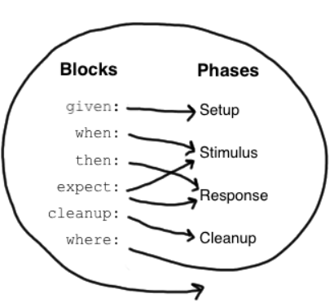

# Spock语法记录
主要有如下几个语法块：
1. given: 用于初始化数据，可省略，之前不能有任何其他代码块，也不能重复，别名setup块
2. when: 与then同时出现，用户执行待测试方法，when可以执行任何任意的代码，可以存在多个when-then块
3. then: 与when共同出现，用于判断方法执行结果，仅限于条件、异常条件、交互和变量定义，可以存在多个when-then块
    ```groovy
        when:
            stack.push(elem)
        then:
            !stack.empty
            stack.size() == 1
            stack.peek() == elem
    ```
   - 条件类似于JUnit的断言，但是可以直接写成布尔表达式，条件最好不超过5个，否则考虑重构特征方法
   - 异常条件：使用thrown(Exception)来判断异常条件，若不传入异常类型，则会自动判断异常
4. expect: expect 代码块是 when-then 代码块的精简版本，但expect 代码块比 then 代码块更有限，只能包含条件和变量定义。在用单一表达式描述刺激和预期响应更为自然的情况下，它非常有用。
5. cleanup: cleanup block 之后只能有一个 where 代码块，且不得重复。与cleanup方法一样，cleanup block 用于释放特征方法使用的任何资源，即使特征方法的（前一部分）产生了异常，清理块也会运行。
6. and: 代码块主要用于跟在 given、when、then 代码块后，用于将大块的代码分割开来，易于阅读。如多组数据测试时可以使用。
7. where: where 块在方法中总是排在最后，并且不能重复。它用于编写数据驱动的特征方法，where能以数据表格的形式一次性写多个测试用例。

块之间不能相互嵌套，块的执行顺序如下



> stub工具类：在单测中会有很多外部依赖，我们需要把外部依赖排除掉，其中有一个很常见的场景是：需要让外部接口返回特定的值。而单测中的 stub 就是用来解决这个问题的，通过 stub 可以让外部接口返回特定的值。

stub使用步骤：
1. 确定需要stub的对象
2. 指定stub对象被调用方法的行为

> mock工具类：功能更强大的stub，还具有对象校验功能

@Unroll 注解 --> 为每组测试数据命名，方便查看出错的数据